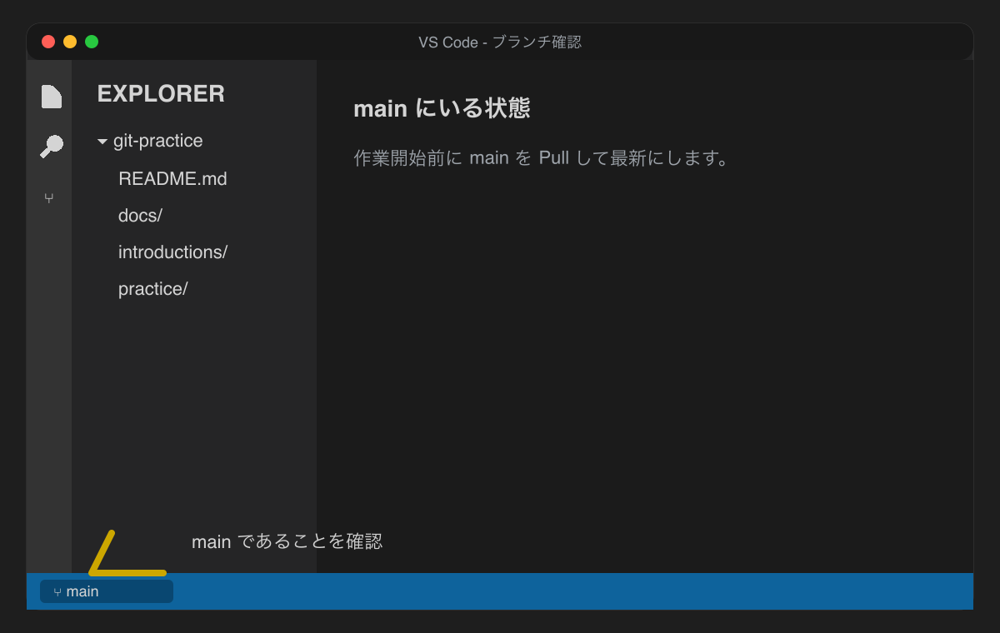
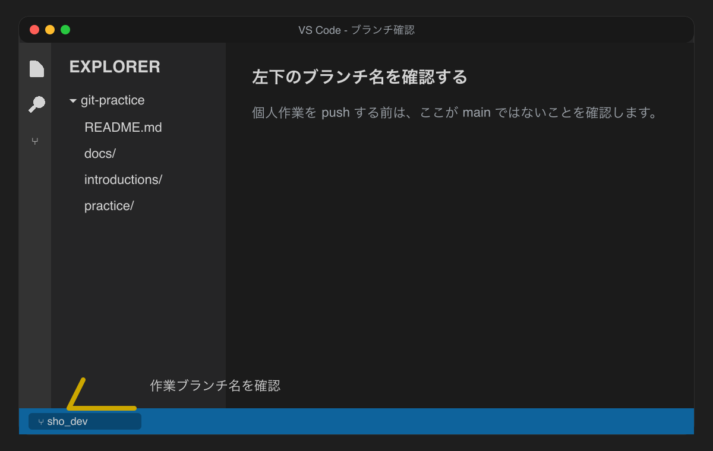
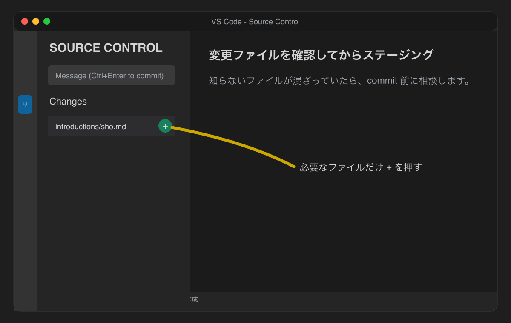
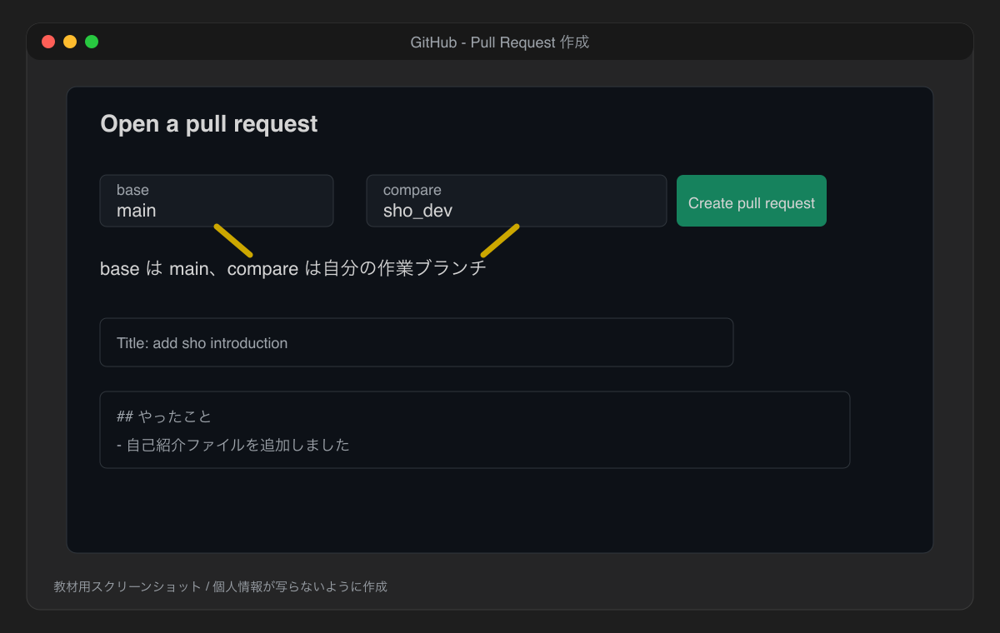
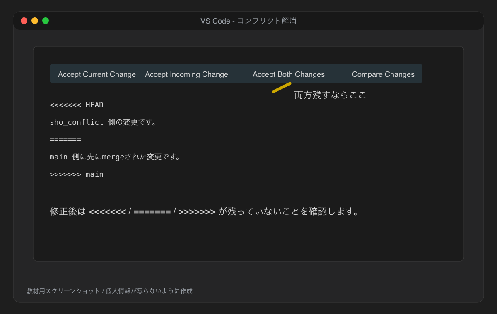

# VS Code操作ガイド

この実習では、ターミナルだけでなくVS Codeの画面操作も使います。

## フォルダを開く

VS Codeで `git-practice` フォルダを開きます。

左側の Explorer に `README.md`、`docs`、`introductions`、`practice` が見えていればOKです。

## 今いるブランチを確認する

VS Code左下のブランチ名を見ます。

- `main`: チーム全員の基準ブランチ
- `github-id_dev`: 自分の作業ブランチ
- `github-id_conflict`: コンフリクト練習用ブランチ

個人作業をpushする前は、左下が `main` ではないことを確認してください。





## mainを最新にする

`main` にいる状態で、Source Control から `Pull` を使います。

`Sync Changes` は pull と push の両方を行うことがあります。`main` 上で `Sync Changes` が表示された場合は、押す前に講師または先輩に相談してください。

## ブランチを作る

1. VS Code左下のブランチ名をクリックする
2. `Create new branch` を選ぶ
3. ブランチ名を入力する
4. 左下の表示が新しいブランチ名になったことを確認する

例:

```text
sho_dev
```

## ファイルを追加する

1. Explorerで `introductions` フォルダを右クリックする
2. `New File` を選ぶ
3. `sho.md` のように英数字でファイル名を入力する
4. 内容を書く
5. 保存する

## 変更を確認する

左側の Source Control アイコンを開きます。

変更したファイルが一覧に表示されます。

知らないファイルや関係ないファイルが表示されている場合は、commitする前に講師または先輩に見せてください。



## ステージングする

Source Control の変更ファイル一覧で、commitしたいファイルの `+` を押します。

実習では、必要なファイルだけを選んでステージングします。

## コミットする

1. Source Control のメッセージ欄に変更内容を書く
2. `Commit` を押す

例:

```text
add sho introduction
```

## pushする

初めてそのブランチをpushするときは、VS Codeに `Publish Branch` が表示されます。

`Publish Branch` を押す前に確認してください。

- 左下のブランチ名が自分の作業ブランチ
- `main` ではない
- Source Control に未コミットの変更が残っていない

## Pull Requestを作る

PRを作る前に確認します。

- VS Code左下のブランチ名が自分の作業ブランチ
- Source Control に未コミットの変更が残っていない
- GitHubに自分のブランチをpush済み

1. GitHubのリポジトリページを開く
2. `Compare & pull request` を押す
3. base が `main` であることを確認する
4. compare が自分の作業ブランチであることを確認する
5. タイトルと本文を書く
6. `Create pull request` を押す
7. URLを講師または先輩に共有する



`Compare & pull request` が表示されない場合:

1. GitHubのリポジトリページで `Pull requests` タブを開く
2. `New pull request` を押す
3. base に `main` を選ぶ
4. compare に自分の作業ブランチを選ぶ
5. 差分を確認する
6. `Create pull request` を押す

## コンフリクトを解消する

コンフリクトしたブランチで `main` を取り込む場合は、先に `main` へ切り替えて `Pull` し、ローカルの `main` を最新にします。

その後、自分のコンフリクト練習用ブランチへ戻り、Command Palette から `Git: Merge Branch...` を選び、`main` を選びます。

VS Codeの表示が環境によって違う場合は、この操作だけ統合ターミナルで行ってください。

コンフリクトしたファイルを開くと、VS Codeにボタンが表示されます。

- `Accept Current Change`: 自分のブランチ側の変更を残す
- `Accept Incoming Change`: 取り込もうとしている `main` 側の変更を残す
- `Accept Both Changes`: 両方の変更を残す
- `Compare Changes`: 差分を見比べる



選んだあと、`<<<<<<<`、`=======`、`>>>>>>>` の記号がファイル内に残っていないことを確認します。

残っていたら、まだコンフリクト解消が終わっていません。
